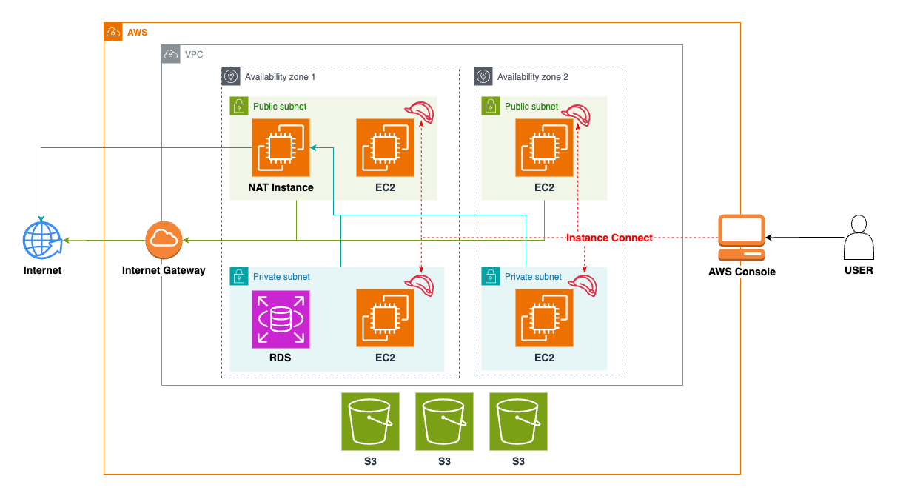

## Architecture Overview



This project implements a comprehensive cloud operations architecture that consists of the following components:

- **VPC Infrastructure**: Secure network setup with public and private subnets across multiple availability zones
- **EC2 Instances**: Application servers deployed in private subnets with auto-scaling capabilities
- **NAT Instances**: Providing outbound internet access for private subnet resources
- **S3 Storage**: For storing application data, logs, and backups
- **RDS Database**: Managed database service for application data persistence
- **IAM Roles**: Properly configured access control for all components
- **Monitoring Stack**: Prometheus for metrics collection and Grafana for visualization

The architecture follows AWS best practices for high availability, security, and scalability, with infrastructure deployed as code using Terraform and configured using Ansible.

## Getting Started

### Prerequisites

- AWS Account
- [AWS CLI](https://aws.amazon.com/cli/)
- [Terraform](https://www.terraform.io/downloads.html) (v1.0.0 or later)
- [Ansible](https://docs.ansible.com/ansible/latest/installation_guide/intro_installation.html)

### Setup AWS CLI

1. Install AWS CLI:

```bash
# macOS (using Homebrew)
brew install awscli

# Linux
curl "https://awscli.amazonaws.com/awscli-exe-linux-x86_64.zip" -o "awscliv2.zip"
unzip awscliv2.zip
sudo ./aws/install
```

2. Configure AWS credentials:

```bash
aws configure
```

Enter your AWS Access Key, Secret Key, default region (e.g., us-east-1), and output format (json recommended).

### Deploying Infrastructure with Terraform

1. Navigate to the terraform/envs/dev directory:

```bash
cd terraform/envs/dev
```

2. Initialize Terraform:

```bash
terraform init
```

3. Review the execution plan:

```bash
terraform plan
```

4. Apply the configuration:

```bash
terraform apply
```

5. After confirmation, Terraform will provision all resources defined in the architecture.

6. When you need to tear down the infrastructure, use the destroy command:

```bash
terraform destroy
```

After confirmation, Terraform will remove all resources that were created.

### Configuring Systems with Ansible

Ansible is used to configure EC2 instances that have been deployed by Terraform. We use dynamic inventory to automatically discover and categorize AWS resources.

1. Ensure AWS credentials are set up so Ansible can access your AWS environment:

```bash
aws configure
```

2. Make sure your SSH key is in the correct location (`~/.ssh/demo-key-pair.pem`) and has the appropriate permissions:

```bash
chmod 400 ~/.ssh/demo-key-pair.pem
```

3. Navigate to the Ansible directory:

```bash
cd ansible
```

4. Install the necessary dependencies:

```bash
pip install ansible boto3 botocore
```

5. Test the dynamic inventory to confirm it can find your EC2 instances:

```bash
ansible-inventory --graph
```

6. Run the playbook to configure all systems:

```bash
ansible-playbook playbooks/site.yml
```

This will perform the following operations:
- Apply common configuration (installing basic packages) to all hosts
- Install and configure Apache on servers tagged with the Web role

### Accessing Monitoring

